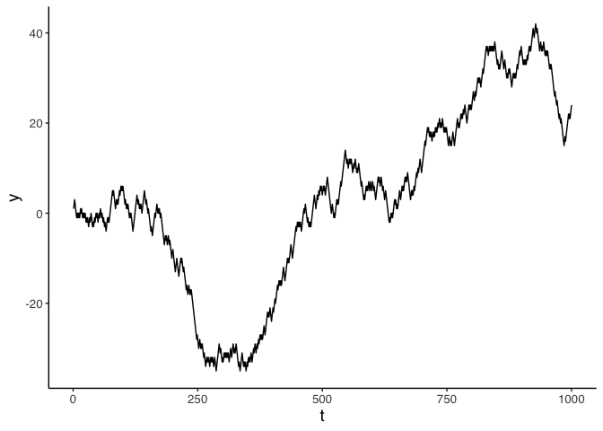
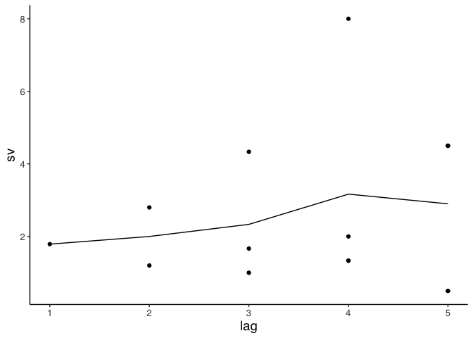
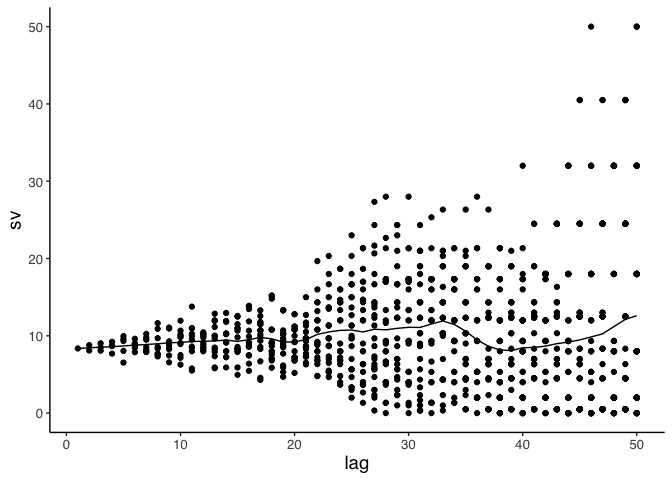

Variogram
================

## Random walk

``` r
#https://stackoverflow.com/questions/21991130/simulating-a-random-walk

n <- 1000

dat <- tibble(t=1:n,
  y=cumsum(sample(c(-1, 1), n, TRUE)))

ggplot(dat,aes(x=t,y=y)) + geom_line()
```

<!-- -->

## Semi-variance

Compute semi-variance at lag 1.

See formula for empirical variogram:
<http://wiki.gis.com/wiki/index.php/Variogram>

Since each observation was taken at a lag of 1, we take all
observations.

``` r
z <- combn(dat$y,2,simplify=TRUE) %>% t #Form every possible pair of observations

sum((z[,1] - z[,2])^2)/length(z) #Calculate semi-variance
```

    ## [1] 406.3365

Now calculate semi-variance for items at lag 2.

Take every other observation.

``` r
y <- dat$y[seq(1,n,by=2)] #Take every other observation.

z <- combn(y,2,simplify=TRUE) %>% t #Form every possible pair of observations

sum((z[,1] - z[,2])^2)/length(z) #Calculate semi-variance
```

    ## [1] 406.4594

But, notice we could have taken two sets at lag 2. One set with
observations (1,3,5,…) and another set with observations (2,4,6,…).

In general, as lag increases, we get more possible sets, but the number
of observations in each set decreases.

## Forming sets of observations at lag = h

Assume n = 10 observations, each taken at lag of 1 (say one per minute
from 1 to 10 minutes).

At lag of 1, we only have one set of size 10

At lag of 2, we have two sets, each of size 5

``` r
seq(1,10,by=2)
```

    ## [1] 1 3 5 7 9

``` r
seq(2,10,by=2)
```

    ## [1]  2  4  6  8 10

At lag 3 we have three sets, with sizes 4, 3, 3

``` r
seq(1,10,by=3)
```

    ## [1]  1  4  7 10

``` r
seq(2,10,by=3)
```

    ## [1] 2 5 8

``` r
seq(3,10,by=3)
```

    ## [1] 3 6 9

At lag 4 we have four sets, with sizes 3,3,2,2

``` r
seq(1,10,by=4)
```

    ## [1] 1 5 9

``` r
seq(2,10,by=4)
```

    ## [1]  2  6 10

``` r
seq(3,10,by=4)
```

    ## [1] 3 7

``` r
seq(4,10,by=4)
```

    ## [1] 4 8

So the number of sets increases but set size decreases until eventually
there are 10 sets of size 1

``` r
lag=10
for(i in 1:lag) {
  print(seq(i,10,by=lag))
}
```

    ## [1] 1
    ## [1] 2
    ## [1] 3
    ## [1] 4
    ## [1] 5
    ## [1] 6
    ## [1] 7
    ## [1] 8
    ## [1] 9
    ## [1] 10

So we only do `max lag/2` ? So in this case max lag would be 5?

``` r
n <- 10
lags <- 1:5

svh <- tibble()

for(lag in lags) {
  
  for(i in 1:lag) {
    
    y <- dat[seq(i,n,by=lag),]$y
    
    z <- combn(y,2,simplify=TRUE) %>% t

    sv <- sum((z[,1] - z[,2])^2)/length(z)
    
    svh <- bind_rows(svh,tibble(lag=lag,sv=sv))
  }
}
```

Plot semivariance by lag (points), and a line for mean semivariance.

``` r
ggplot(svh,aes(x=lag,y=sv)) + 
  geom_point() +
  geom_line(dat=svh %>% group_by(lag) %>% summarize(sv=mean(sv)))
```

<!-- -->

Put it all together with larger number of points.

``` r
n <- 100
lags <- 1:(n/2)
svh <- tibble()

dat <- tibble(t=1:n,
  y=cumsum(sample(c(-1, 1), n, TRUE)))

tic()
for(lag in lags) {
  #lag=2
  for(i in 1:lag) {
    #i=1
    y <- dat[seq(i,n,by=lag),]$y
    
    z <- combn(y,2,simplify=TRUE) %>% t

    sv <- sum((z[,1] - z[,2])^2)/length(z)
    
    svh <- bind_rows(svh,tibble(lag=lag,sv=sv))
  }
}
toc()
```

    ## 1.425 sec elapsed

``` r
ggplot(svh,aes(x=lag,y=sv)) + 
  geom_point() +
  geom_line(dat=svh %>% group_by(lag) %>% summarize(sv=mean(sv)))
```

<!-- -->
